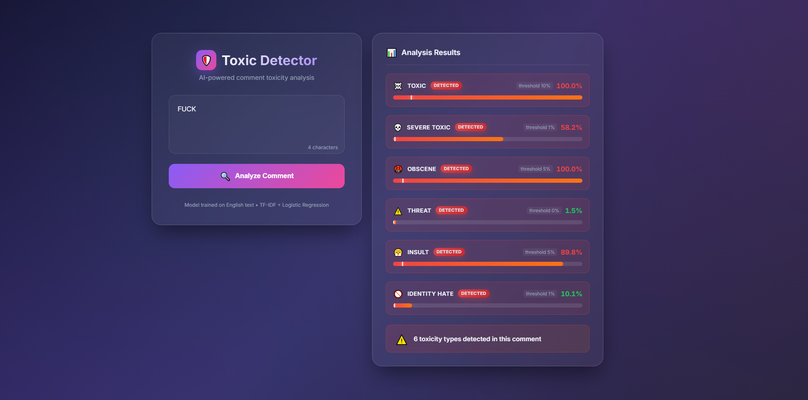
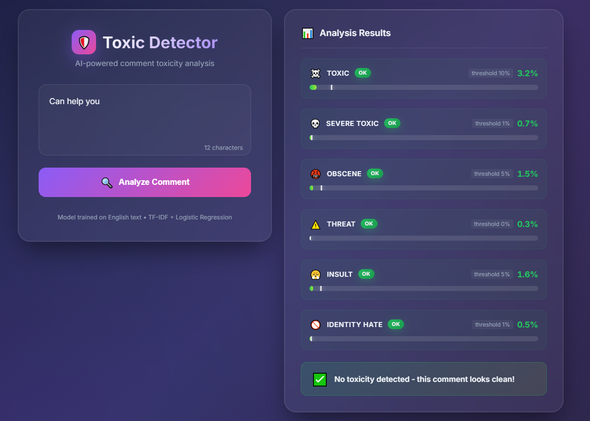

# Toxic Comment Classification

Проект классификации токсичных комментариев (Multi-label text classification). Модель определяет вероятность принадлежности текста к одному или нескольким из 6 классов: `toxic`, `severe_toxic`, `obscene`, `threat`, `insult`, `identity_hate`.
Реализовал веб-приложение (FastAPI) для демонстрации работы модели в реальном времени. Добавил Dockerfile для контейнеризации и удобного развертывания.


## 📊 Результаты моделей

| Модель | ROC-AUC | F1 (macro) | F1 (micro) | Precision | Recall |
|--------|---------|------------|------------|-----------|--------|
| BERT + LogReg | 0.977 | 0.60 | 0.71 | 0.40 | 0.63 |
| **TF-IDF + LogReg** | **0.972** | 0.59 | 0.71 | 0.39 | 0.61 |
| **BiLSTM + FastText** | **0.98** | 0.61 | 0.75 | 0.42 | 0.63 |
| FastText + LogReg | 0.82 | 0.26 | 0.34 | 0.11 | 0.30 |

##  Выводы

TF-IDF задал очень высокую базавую планку (AUC ~0.97), доказав, что токсичность на 90% определяется наличием конкретных слов-триггеров в первую очередь, а уже во вторую сложнымы контекстом.

Однако лучший результат показала BiLSTM, устранив главную проблему простых эмбеддингов: при обычном усреднении (Mean Pooling) вектор одного ругательства терялся в длинном тексте, а рекуррентная сеть смогла выловить этот сигнал в последовательности. BERT (без файн-тюнинга) показал схожее качество, но оказался вычислительно слишком дорогим для задачи, которая так хорошо решается через TF-IDF + LogReg.

## 📊 Описание данных

Набор данных [Jigsaw Toxic Comment Classification](https://www.kaggle.com/c/jigsaw-toxic-comment-classification-challenge) содержит ~160k комментариев из Википедии, размеченных по 6 классам токсичности.

**Дисбаланс классов**: ~90% комментариев — нетоксичные. Классы `threat` и `severe_toxic` встречаются особенно редко, что требует специальных подходов (взвешивание классов, подбор порогов).

## 🛠 Технологии

| Категория | Инструменты |
|-----------|-------------|
| ML/DL | PyTorch, Scikit-learn, Transformers (BERT) |
| NLP | TF-IDF, FastText, Gensim |
| **Web / API** | **FastAPI**, **Uvicorn**, **Jinja2** (HTML/CSS/JS) |
| Интерпретация | SHAP |
| Визуализация | Matplotlib |

## 🌐 Веб-приложение и API

В проект интегрировано веб-приложение для демонстрации работы модели в реальном времени.

### Функционал:
*   **Web Interface**: Удобный UI с визуализацией уровня токсичности по всем категориям.
*   **API**: REST API метод `/api/classify` для интеграции со сторонними сервисами.
*   **Docker**: Dockerfile для контейнеризации приложения и упрощения развертывания.
*   **Валидация**: Автоматическая проверка языка ввода (поддержка только английского, заглушка для русского).

### 🚀 Как запустить

1.  Установите зависимости:
    ```bash
    pip install -r requirements.txt
    ```

2.  Запустите сервер из корня проекта:
    ```bash
    python app/main.py
    ```

3.  Откройте браузер:
    *   **Веб-интерфейс:** [http://127.0.0.1:8000](http://127.0.0.1:8000)
    *   **API Документация (Swagger):** [http://127.0.0.1:8000/docs](http://127.0.0.1:8000/docs)

### 🚀 Скриншоты 



### 🚀 Запуск через Docker
```bash
    docker build -t toxic-app .
    docker run -p 8000:8000 toxic-app
```

## 📁 Структура проекта

```text
toxic_text/
├── app/                       # Веб-приложение (FastAPI)
│   ├── templates/             # HTML шаблоны
│   │   └── index.html         # UI с визуализацией
│   └── main.py                # Серверная логика API
├── model/                     # Артефакты для инференса
│   ├── tfidf_classifier.pkl   # Обученная Логистическая Регрессия
│   ├── tfidf_vectorizer.pkl   # Векторизатор TF-IDF
│   └── thresholds.pkl         # Оптимальные пороги для каждого класса
├── data/
│   ├── train.csv              # Обучающий датасет
│   └── test.csv               # Тестовый датасет
├── src/                       # Вспомогательные скрипты
│   ├── BiLSTM.py              # Архитектура BiLSTM модели
│   ├── FastTextVectorizer.py  # Обертка FastText для Sklearn
│   ├── loader.py              # PyTorch Dataset/DataLoader
│   ├── train_LSTM.py          # Пайплайн обучения нейросети
│   ├── preprocess_data.py     # Препроцессинг текста
│   ├── find_optimal_threshold.py # Алгоритм максимизации F1-score
│   ├── utils.py               # Метрики
│   └── shap_show.py           # SHAP визуализация
├── lin_reg.ipynb              # Эксперименты: TF-IDF + LogReg
├── lstm.ipynb                 # Эксперименты: Deep Learning (BiLSTM)
├── bert_tox_class.ipynb       # Эксперименты: Transformers (BERT)
├── requirements.txt           # Зависимости проекта
└── README.md
```

## 🔎 Интерпретация моделей

### TF-IDF: Топ токсичных признаков
Модель явно опирается на ключевые слова: `fuck`, `shit`, `idiot`, `stupid` имеют максимальные веса.

### FastText: Вклад эмбеддингов
Модель на FastText использует семантическое сходство, а не точное совпадение слов. Функция `word_contributions()` показывает вклад каждого слова для каждого класса токсичности.

### SHAP-анализ
Визуализация важности признаков для конкретных предсказаний.


## 📚 Ресурсы

- [Kaggle Competition](https://www.kaggle.com/c/jigsaw-toxic-comment-classification-challenge)
- [Scikit-learn Multi-label Classification](https://scikit-learn.org/stable/modules/multiclass.html)
- [Gensim FastText](https://radimrehurek.com/gensim/models/fasttext.html)
- [SHAP Documentation](https://shap.readthedocs.io/)
- [Hugging Face Transformers](https://huggingface.co/docs/transformers/)

---

**Автор**: Личный проект для обучения. 

